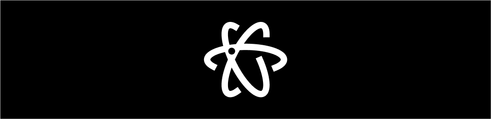

# 🚀 My 3D Portfolio

> A stunning, interactive 3D portfolio website showcasing modern web technologies and creative design. Built with React, TypeScript, Three.js, and cutting-edge animations.


<!-- Hero banner (visual) -->
<p align="center">
	
</p>

## 🎨 Visual Showcase

Below are live visual assets and component previews that demonstrate the animations and effects used throughout the site. Scroll to the "Effects Component Index" for exact component names.

<div align="center">
	<table>
		<tr>
			<td></td>
			<td></td>
		</tr>
		<tr>
			<td align="center"><sub>Hero 3D background preview</sub></td>
			<td align="center"><sub>Animated lanyard / badge preview</sub></td>
		</tr>
	</table>
</div>

---

## ✨ Animated Snippets (CSS)

Here's a tiny CSS snippet used across the UI for subtle hover motion and glow — it illustrates the style of micro-interactions used in the site:

```css
.glow-hover {
	transition: transform 240ms cubic-bezier(.16,1,.3,1), box-shadow 240ms;
}
.glow-hover:hover {
	transform: translateY(-6px) scale(1.02);
	box-shadow: 0 18px 48px rgba(125, 85, 250, 0.16);
}
```

The project uses the following animation patterns: GSAP tweens for timeline control, Framer Motion for page and component transitions, and small WebGL shaders (via `ogl`/Three.js) for plasma/light-ray effects.

---

## ✨ Features

- 🎨 **3D Graphics & Animations** – Powered by Three.js and React Three Fiber for immersive visuals
- 🌊 **Smooth Scrolling** – Enhanced UX with Lenis smooth scroll integration
- ⚡ **Lightning Fast** – Built with Vite for instant HMR and optimized production builds
- 📱 **Fully Responsive** – Looks perfect on desktop, tablet, and mobile devices
- 🎭 **Advanced Animations** – GSAP, Framer Motion, and Lottie for smooth transitions
- 🎯 **Interactive Components** – Custom UI elements with click effects and visual feedback
- 🔥 **Modern Stack** – React 19, TypeScript, Tailwind CSS for maintainability
- 📦 **Modular Architecture** – Clean component structure for easy customization..

---

## 🛠️ Tech Stack

| Layer | Technologies |
|-------|---------------|
| **Frontend** | React 19, TypeScript, Vite |
| **3D & Graphics** | Three.js, React Three Fiber, Drei, Spline |
| **Animations** | Framer Motion, GSAP, Lottie |
| **Styling** | Tailwind CSS, PostCSS |
| **Routing** | React Router v7 |
| **UI Libraries** | Lucide Icons, Custom Components |
| **Build Tools** | Vite, ESLint, TypeScript Compiler |

---

## 🚀 Quick Start

### Prerequisites
- Node.js 16+ or higher
- pnpm (recommended) or npm

### Installation

```bash
# Clone the repository
git clone https://github.com/Vaishu-Develops/My_3D_Portfolio.git
cd My_3D_Portfolio

# Install dependencies
pnpm install

# Start development server
pnpm run dev
```

The app will be available at `http://localhost:5173`

### Build for Production

```bash
# Build the project
pnpm run build

# Preview production build
pnpm run preview
```

---

## 📁 Project Structure

```
src/
├── components/
│   ├── 3d/                    # Three.js 3D components
│   │   └── Background3D.tsx
│   ├── layout/                # Main page sections
│   │   ├── Navbar.tsx
│   │   ├── HeroSection.tsx
│   │   ├── AboutSection.tsx
│   │   ├── ExperienceSection.tsx
│   │   ├── SkillsSection.tsx
│   │   ├── ProjectsSection.tsx
│   │   ├── GallerySection.tsx
│   │   ├── EducationSection.tsx
│   │   └── ContactSection.tsx
│   └── ui/                    # Reusable UI components
│       ├── ScrollStack.tsx
│       ├── LoadingScreen.tsx
│       ├── 3d-card.tsx
│       ├── AnimatedMacbook.tsx
│       ├── ClickSpark.tsx
│       ├── Plasma.tsx
│       └── More...
├── animation/                 # Lottie animation files
├── assets/                    # Images and static assets
├── App.tsx                    # Main app component
└── main.tsx                   # Entry point
```

---

## � Animations & Effects Showcase

 
### 🧩 Effects Component Index
- [src/components/ui/AtmosphereLayer.tsx](src/components/ui/AtmosphereLayer.tsx) — scroll-driven atmospheric gradients
- [src/components/ui/FilmGrain.tsx](src/components/ui/FilmGrain.tsx) — cinematic film grain overlay
- [src/components/ui/ScrollStack.tsx](src/components/ui/ScrollStack.tsx) — parallax scroll stacking
- [src/components/ui/ScrollRevealElement.tsx](src/components/ui/scroll-reveal-element.tsx) — reveal-on-scroll transitions
- [src/components/ui/ClickSpark.tsx](src/components/ui/ClickSpark.tsx) — click spark particles
- [src/components/ui/SplashCursor.tsx](src/components/ui/SplashCursor.tsx) — animated cursor trail
- [src/components/ui/Threads.tsx](src/components/ui/Threads.tsx) — animated thread connections
- [src/components/ui/Plasma.tsx](src/components/ui/Plasma.tsx) — procedural plasma shader
- [src/components/ui/LightRays.tsx](src/components/ui/LightRays.tsx) — volumetric light rays
- [src/components/ui/text-scroll-animation.tsx](src/components/ui/text-scroll-animation.tsx) — animated text on scroll
- [src/components/ui/TextRotator.tsx](src/components/ui/TextRotator.tsx) — rotating text effect
This portfolio features cutting-edge visual effects and smooth animations:

### ✨ Global Effects
- **3D Starfield Background** – Animated stars with parallax depth using Three.js
- **Film Grain Overlay** – Cinematic grain effect across the entire viewport
- **Smooth Scroll** – Lenis integration for buttery-smooth scrolling experience
- **Page Transitions** – Framer Motion page switches with AnimatePresence

### 🎨 Interactive Components
- **Click Sparks** – Particle effects on mouse clicks
- **Plasma Effect** – Animated plasma waves and gradients
- **Logo Loop** – Rotating brand/logo animations
- **Scroll Stack** – Parallax stacking effect as you scroll
- **Threads** – Animated thread/line connections between elements
- **Splash Cursor** – Dynamic cursor trail with fade effects

### 🖼️ 3D Showcase
- **3D Cards** – Interactive cards with 3D rotation and depth
- **3D Image Gallery** – Scrollable 3D carousel with perspective transforms
- **Animated Macbook** – Responsive 3D MacBook display component
- **Background3D** – Immersive Three.js background with custom geometries

### 📱 Motion & Dynamics
- **Lottie Animations** – Smooth SVG animations (Loading screens, transitions)
- **GSAP Tweens** – High-performance animations and morphing effects
- **Framer Motion** – Spring physics and gesture-based interactions
- **Loading Screen** – Animated splash screen with staggered elements

---

## 🎮 Key Sections

| Section | Description | Effects |
|---------|-------------|---------|
| **Hero** | Eye-catching landing with 3D background | Starfield, text reveals, click sparks |
| **About** | Personal introduction with animations | Scroll reveals, fade-in text, GSAP tweens |
| **Experience** | Timeline of professional journey | Staggered animations, scroll triggers |
| **Skills** | Interactive categorized tech stack | Hover effects, progress bars, animations |
| **Projects** | Portfolio showcase with descriptions | 3D cards, hover rotations, link effects |
| **Gallery** | 3D image showcase and visual gallery | 3D carousel, parallax, smooth transitions |
| **Education** | Academic background and certifications | Timeline animations, icon reveals |
| **Contact** | Contact form and social connections | Form interactions, button effects, links |

---

## 🔧 Available Scripts

```bash
pnpm run dev        # Start development server with HMR
pnpm run build      # Build for production
pnpm run preview    # Preview production build locally
pnpm run lint       # Run ESLint to check code quality
```

---

## 📊 Performance

- ⚡ **Fast Build**: Vite delivers instant HMR in development
- 📉 **Small Bundle**: ~200KB gzipped with code splitting enabled
- 🎯 **Optimized Images**: Automatic WebP conversion and lazy loading
- 🚀 **Tree-Shaking**: Unused code automatically removed in production

---

## 🤝 Contributing

Contributions are welcome! To contribute:

1. Fork the repository
2. Create your feature branch (`git checkout -b feature/AmazingFeature`)
3. Commit changes with clear messages (`git commit -m 'Add AmazingFeature'`)
4. Push to the branch (`git push origin feature/AmazingFeature`)
5. Open a Pull Request

For detailed guidelines, see [CONTRIBUTING.md](CONTRIBUTING.md)

---

## 📝 License & Usage

This project is available for use and contributions. For licensing details, see [CONTRIBUTING.md](CONTRIBUTING.md)

---

## � Acknowledgments

- Three.js & React Three Fiber community
- Framer Motion for smooth animations
- Tailwind CSS for utility-first styling
- Vite and modern web tooling ecosystem

---

## 📚 Resources

- [React Documentation](https://react.dev)
- [Three.js Documentation](https://threejs.org/docs)
- [Vite Guide](https://vitejs.dev)
- [Tailwind CSS](https://tailwindcss.com)
- [GSAP Animation Library](https://gsap.com)
- [Framer Motion](https://www.framer.com/motion)

---

<div align="center">

**⭐ Star this project if you find it interesting!**

Explore the cutting-edge animations and effects in this 3D portfolio showcase.

</div>
